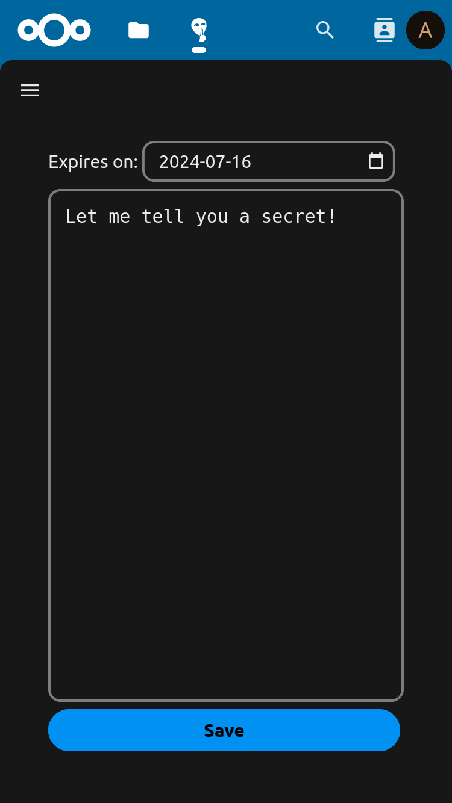
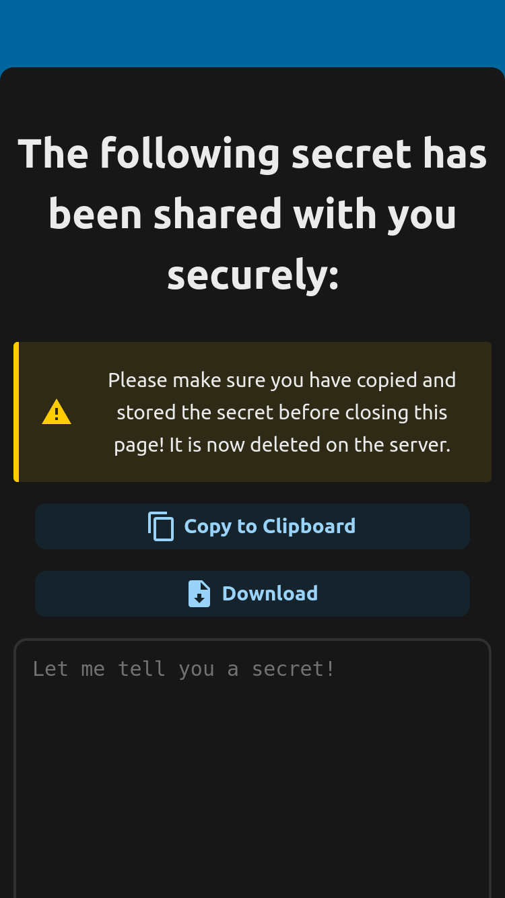
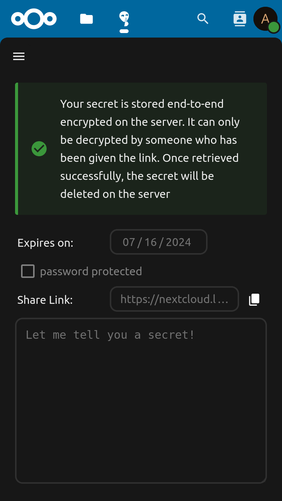
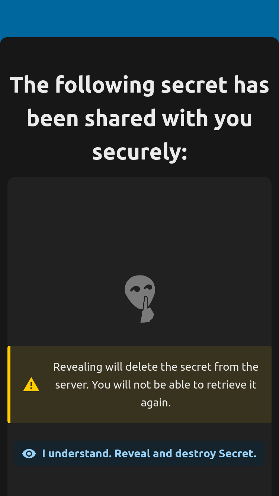
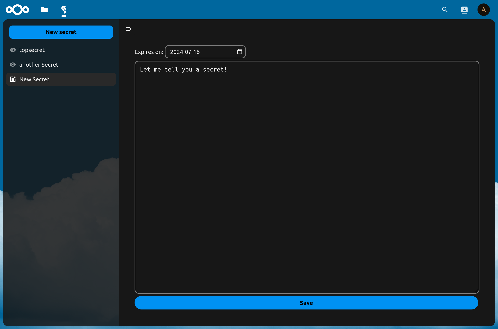
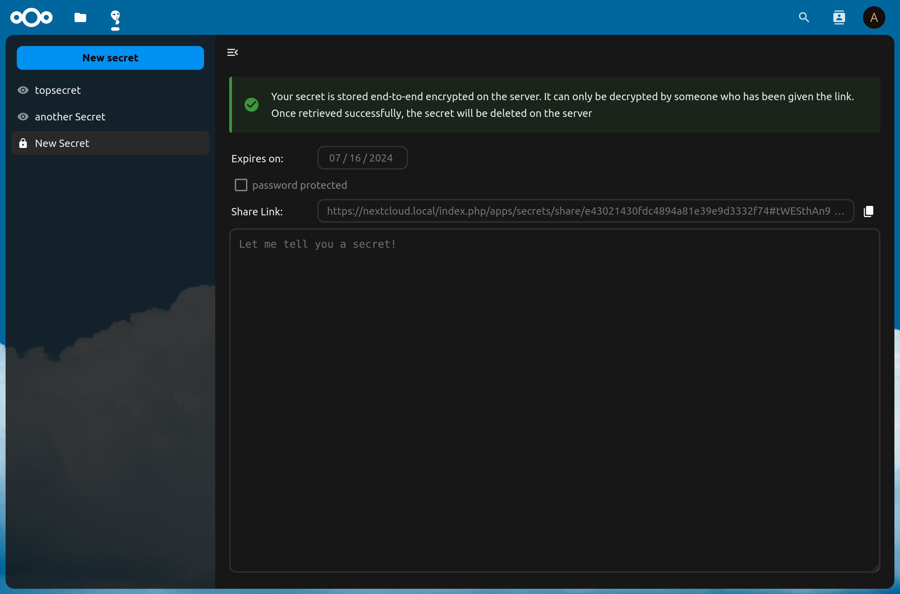
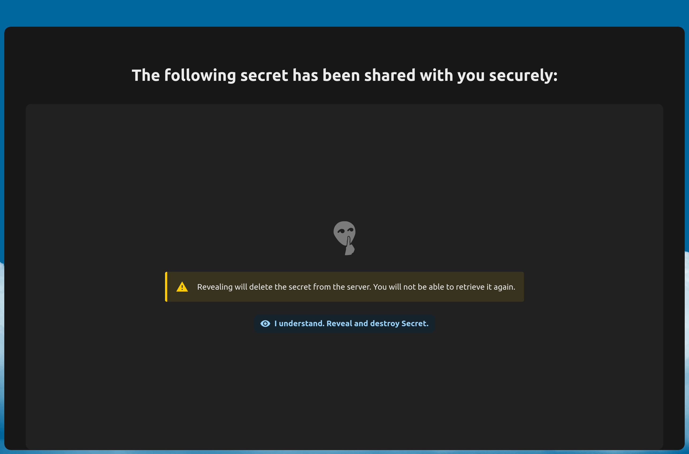
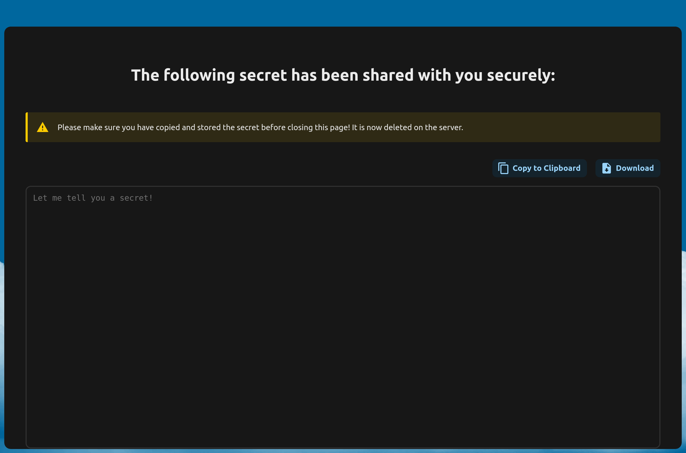

<!--
SPDX-FileCopyrightText: Tobias Knöppler <thecalcaholic@web.de>
SPDX-License-Identifier: CC0-1.0
-->

# Secrets

*Securely share data with anyone. All data is end-to-end encrypted by the user and will be deleted once retrieved successfully*

<div>
    
    
</div>

<details>
    <summary>More Screenshots</summary>
    
    
    
    
    
    
    
</details>

Get it from the [Nextcloud app store](https://apps.nextcloud.com/apps/secrets)

## Sharing

Secrets allows users to generate share links for text based data (e.g. passwords, CSV lists, bank accounts...) that can
be sent to anyone (including receivers without a Nextcloud account) for retrieval.
The data itself will be end-to-end encrypted (so not even Nextcloud can access it) and the encryption key will be part of
the share link (the anchor part) - but never be actually sent to the server.
Once retrieved, the secret will be deleted from the server, ensuring, that if it arrived at the correct receiver it has
been seen by nobody else.

## Cli

Starting with version 2.0.0, Secrets offers a command line tool that allows the creation and retrieval of secrets without a web browser.
It's available from the [github releases](https://github.com/thecalcaholic/nextcloud-secrets/releases).

### Usage

```sh
Usage: nc-secrets [options] [command]

cli for https://apps.nextcloud.com/apps/secrets

Options:
  -k, --insecure                                         Disable SSL certificate validation (FOR TESTING ONLY)
  -h, --help                                             display help for command

Commands:
  create [options] <nextcloud-url> <user> <secret-file>  Create a new secret
  retrieve [options] <secret-url>                        Retrieve a secret and print it to stdout
  info <nextcloud-url>                                     Get information about a Nextcloud Secrets API
  help [command]                                         display help for command
```

More details [here](./cli/README.md).

## OCS-API

Starting with version 2.0.0, Secrets provides an OCS-API (that's also used by the [Secrets CLI](#cli)).
It's specification can be found [here](./openapi.json);

**However, all of the encryption is not part of the API, but is solved in the client (since Secrets uses solely 
end-to-end encryption). So take care when using the OCS-API directly.
You can find the implementation of Secrets' client cryptography [here](./src/crypto.js)**

## Development

### Building the app

The app can be built by using the provided Makefile by running:

```sh
make
```

This requires the following things to be present:
* make
* which
* tar: for building the archive
* curl: used if phpunit and composer are not installed to fetch them from the web
* npm: for building and testing everything JS, only required if a package.json is placed inside the **js/** folder

The make command will install or update Composer dependencies and also **npm run build**.

### Publish to App Store

First get an account for the [App Store](http://apps.nextcloud.com/) then run:

    make && make appstore

The archive is located in build/artifacts/appstore and can then be uploaded to the App Store.

### Running tests
You can use the provided Makefile to run all tests by using:

    make test

This will run the PHP unit and integration tests and if a package.json is present in the **js/** folder will execute **npm run test**

Of course you can also install [PHPUnit](http://phpunit.de/getting-started.html) and use the configurations directly:

    phpunit -c phpunit.xml

or:

    phpunit -c phpunit.integration.xml

for integration tests

### Generating OpenAPI specification

This command will generate a file namd openapi.json which contains the documentation for the app's API endpoints. 

```sh
compose exec generate-spec
```

This command is not included in make, due to [this bug with Nextcloud's openapi-extractor](https://github.com/nextcloud/openapi-extractor/issues/28)
and therefore needs to be run manually before release.
